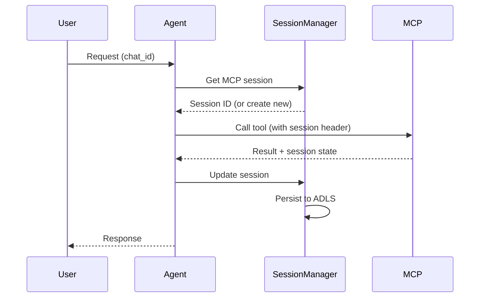

# MCP Integration Guide

Connect to external Model Context Protocol (MCP) servers for additional tool capabilities.

## Overview

MCP (Model Context Protocol) allows the agent to connect to external tool servers. The framework supports:

- **stdio** — Local subprocess servers
- **HTTP/SSE** — REST API + Server-Sent Events
- **WebSocket** — Full-duplex connections
- **Stateful Sessions** — Session management for stateful backends

## Quick Start

### stdio Server (Subprocess)

```toml
# config/agent.toml
[[agent.mcp]]
name = "calculator"
type = "stdio"
enabled = true
command = "uvx"
args = ["mcp-server-calculator"]
```

### HTTP Server

```toml
[[agent.mcp]]
name = "api-service"
type = "http"
enabled = true
url = "https://api.example.com/mcp"
headers = { Authorization = "Bearer ${API_TOKEN}" }
```

### WebSocket Server

```toml
[[agent.mcp]]
name = "realtime"
type = "websocket"
enabled = true
url = "wss://api.example.com/mcp"
headers = { "X-API-Key" = "${API_KEY}" }
```

## Configuration

### Common Options

| Option | Type | Description |
|--------|------|-------------|
| `name` | string | Unique identifier for the MCP server |
| `type` | string | Transport type: `stdio`, `http`, `websocket` |
| `enabled` | bool | Enable/disable this server |

### stdio Options

| Option | Type | Description |
|--------|------|-------------|
| `command` | string | Executable command |
| `args` | list | Command arguments |
| `env` | dict | Environment variables |
| `cwd` | string | Working directory |

```toml
[[agent.mcp]]
name = "filesystem"
type = "stdio"
enabled = true
command = "npx"
args = ["-y", "@modelcontextprotocol/server-filesystem", "/data"]
env = { NODE_ENV = "production" }
cwd = "/app"
```

### HTTP Options

| Option | Type | Description |
|--------|------|-------------|
| `url` | string | Server URL |
| `headers` | dict | HTTP headers |
| `timeout` | int | Request timeout (seconds) |

```toml
[[agent.mcp]]
name = "api"
type = "http"
enabled = true
url = "https://api.example.com/mcp"
headers = {
    Authorization = "Bearer ${API_TOKEN}",
    "X-Client-ID" = "ai-assistant"
}
timeout = 30
```

### WebSocket Options

| Option | Type | Description |
|--------|------|-------------|
| `url` | string | WebSocket URL (wss://) |
| `headers` | dict | Connection headers |
| `ping_interval` | int | Keep-alive interval (seconds) |

```toml
[[agent.mcp]]
name = "realtime"
type = "websocket"
enabled = true
url = "wss://api.example.com/mcp"
headers = { Authorization = "Bearer ${TOKEN}" }
ping_interval = 30
```

## Stateful MCP Sessions

For MCP servers that maintain state (e.g., database connections, ERP systems):

```toml
[[agent.mcp]]
name = "d365-erp"
type = "http"
enabled = true
url = "https://d365-mcp.example.com/api/mcp"
headers = { Authorization = "Bearer ${D365_TOKEN}" }

# Enable stateful sessions
stateful = true
session_header = "X-D365-Session-Id"
form_context_header = "X-D365-Form-Context"
requires_user_id = true

[agent.mcp_sessions]
enabled = true
session_ttl = 3600        # 1 hour
persist_sessions = true   # Save to ADLS
```

### Session Lifecycle



### Session Management API

```python
from src.mcp.session import MCPSessionManager

session_manager = MCPSessionManager(config)

# Get or create session for a chat
session_id = await session_manager.get_session(
    chat_id="user-123",
    mcp_server="d365-erp"
)

# Store session state
await session_manager.update_session(
    chat_id="user-123",
    mcp_server="d365-erp",
    session_data={"form_id": "SO001"}
)

# Clean up session
await session_manager.close_session(
    chat_id="user-123",
    mcp_server="d365-erp"
)
```

## Environment Variables

Use environment variables for sensitive values:

```toml
[[agent.mcp]]
name = "secure-api"
type = "http"
url = "https://api.example.com/mcp"
headers = {
    Authorization = "Bearer ${API_TOKEN}",
    "X-API-Key" = "${API_KEY}"
}
```

```bash
export API_TOKEN="your-token"
export API_KEY="your-key"
```

## Popular MCP Servers

### Calculator

```toml
[[agent.mcp]]
name = "calculator"
type = "stdio"
command = "uvx"
args = ["mcp-server-calculator"]
```

### Filesystem

```toml
[[agent.mcp]]
name = "filesystem"
type = "stdio"
command = "npx"
args = ["-y", "@modelcontextprotocol/server-filesystem", "/allowed/path"]
```

### Web Search (Brave)

```toml
[[agent.mcp]]
name = "brave-search"
type = "stdio"
command = "npx"
args = ["-y", "@anthropic/mcp-server-brave-search"]
env = { BRAVE_API_KEY = "${BRAVE_API_KEY}" }
```

### GitHub

```toml
[[agent.mcp]]
name = "github"
type = "stdio"
command = "npx"
args = ["-y", "@anthropic/mcp-server-github"]
env = { GITHUB_TOKEN = "${GITHUB_TOKEN}" }
```

### PostgreSQL

```toml
[[agent.mcp]]
name = "postgres"
type = "stdio"
command = "npx"
args = ["-y", "@anthropic/mcp-server-postgres", "${DATABASE_URL}"]
```

## Debugging MCP Connections

### Enable Debug Logging

```toml
[agent]
log_level = "DEBUG"
```

### Test Connection

```python
from src.loaders.mcp import MCPManager

async def test_mcp():
    manager = MCPManager(config)
    await manager.initialize()

    # List available tools
    tools = manager.get_tools()
    for tool in tools:
        print(f"Tool: {tool.name} from {tool.server}")

    # Test tool call
    result = await manager.call_tool(
        server="calculator",
        tool="add",
        arguments={"a": 1, "b": 2}
    )
    print(f"Result: {result}")
```

### Common Issues

| Issue | Solution |
|-------|----------|
| Connection refused | Check URL/command is correct |
| Authentication failed | Verify headers/tokens |
| Tool not found | Check MCP server exposes expected tools |
| Timeout | Increase `timeout` setting |
| Session lost | Enable `persist_sessions` |

## Building Custom MCP Servers

### Python Server (HTTP)

```python
from fastapi import FastAPI
from mcp.server import Server

app = FastAPI()
mcp = Server("my-server")

@mcp.tool("my_tool")
async def my_tool(param: str) -> str:
    """Description for the LLM."""
    return f"Processed: {param}"

# Mount MCP endpoints
app.mount("/mcp", mcp.app)
```

### Node.js Server (stdio)

```javascript
import { Server } from "@modelcontextprotocol/server-node";

const server = new Server({
  name: "my-server",
  version: "1.0.0"
});

server.defineTool("my_tool", {
  description: "Description for the LLM",
  parameters: {
    type: "object",
    properties: {
      param: { type: "string", description: "Input parameter" }
    },
    required: ["param"]
  }
}, async ({ param }) => {
  return `Processed: ${param}`;
});

server.run();
```

## Security Considerations

### Network Security

- Use HTTPS/WSS for remote servers
- Configure firewall rules
- Use private endpoints in production

### Authentication

- Use tokens with minimal required permissions
- Rotate credentials regularly
- Store secrets in Key Vault

### Input Validation

```toml
[agent.security.validation]
# Validate tool parameters
max_tool_param_length = 10000
```

### Tool Whitelisting

```python
# Restrict which MCP tools can be called
config = ValidationConfig(
    allowed_tools=["calculator.add", "calculator.multiply"],
    blocked_tools=["filesystem.delete"]
)
```

## Related Documentation

- [Architecture Overview](../architecture/index.md) — MCP architecture
- [Tools Guide](tools.md) — Local tools
- [Configuration Reference](../reference/configuration-reference.md) — MCP options
- [Security Guide](security.md) — Security best practices
