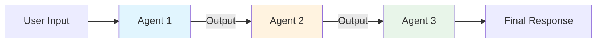
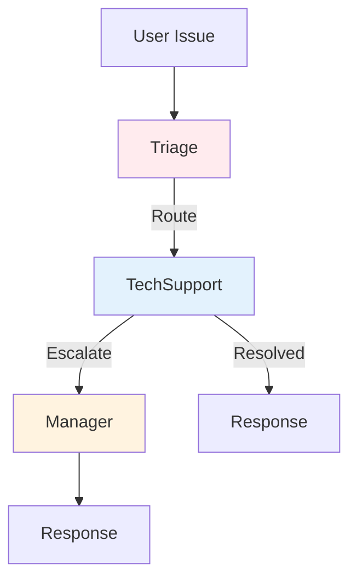

# Multi-Agent Workflows Guide

Create and configure multi-agent workflows for complex orchestration patterns.

## Overview

Workflows allow you to chain multiple agents together in predefined patterns:

- **Sequential Workflows** — Agents execute in order, each receiving the previous agent's output
- **Custom Workflows** — Graph-based workflows with conditional routing

## Quick Start

### Sequential Workflow

```toml
# config/agent.toml
[[agent.workflows]]
name = "content-pipeline"
type = "sequential"
enabled = true

[[agent.workflows.agents]]
name = "Researcher"
instructions = "Research the given topic and provide key facts and insights."

[[agent.workflows.agents]]
name = "Writer"
instructions = "Write engaging content based on the research provided."

[[agent.workflows.agents]]
name = "Reviewer"
instructions = "Review the content and provide a final polished version."
```

### Run the Workflow

```python
import asyncio
from src.agent import AIAssistant

async def main():
    async with AIAssistant() as assistant:
        result = await assistant.run_workflow(
            "content-pipeline",
            "Write about the benefits of AI in healthcare"
        )
        print(result.response)

asyncio.run(main())
```

## Sequential Workflows

### Configuration

```toml
[[agent.workflows]]
name = "workflow-name"
type = "sequential"
enabled = true

[[agent.workflows.agents]]
name = "Agent1"
instructions = "First agent instructions"
# model = "gpt-4o"  # Optional: use specific model

[[agent.workflows.agents]]
name = "Agent2"
instructions = "Second agent instructions"
# model = "claude"  # Optional: use different model

[[agent.workflows.agents]]
name = "Agent3"
instructions = "Third agent instructions"
```

### Data Flow



Each agent receives:
1. The workflow context (original user input)
2. The previous agent's output (except the first agent)

### Example: Research Pipeline

```toml
[[agent.workflows]]
name = "research-pipeline"
type = "sequential"
enabled = true

[[agent.workflows.agents]]
name = "Researcher"
instructions = """
Research the given topic thoroughly. Provide:
- Key facts and statistics
- Recent developments
- Expert opinions
- Relevant sources
"""

[[agent.workflows.agents]]
name = "Analyst"
instructions = """
Analyze the research findings. Provide:
- Key insights and patterns
- Implications
- Potential challenges
- Recommendations
"""

[[agent.workflows.agents]]
name = "Reporter"
instructions = """
Write a comprehensive report based on the research and analysis.
Use clear headings, bullet points, and a professional tone.
Include an executive summary at the beginning.
"""
```

## Custom Workflows (Graph-Based)

### Configuration

```toml
[[agent.workflows]]
name = "support-escalation"
type = "custom"
enabled = true
start = "Triage"

[[agent.workflows.agents]]
name = "Triage"
instructions = "Analyze the customer issue and determine severity (low/medium/high)."

[[agent.workflows.agents]]
name = "TechSupport"
instructions = "Provide technical solutions for the issue."

[[agent.workflows.agents]]
name = "Manager"
instructions = "Handle escalated issues with empathy and resolution authority."

[[agent.workflows.edges]]
from = "Triage"
to = "TechSupport"

[[agent.workflows.edges]]
from = "TechSupport"
to = "Manager"
```

### Graph Structure



### Conditional Routing (Future)

```toml
# Planned feature: conditional edges
[[agent.workflows.edges]]
from = "Triage"
to = "TechSupport"
condition = "severity in ['low', 'medium']"

[[agent.workflows.edges]]
from = "Triage"
to = "Manager"
condition = "severity == 'high'"
```

## Multi-Model Workflows

Use different LLM providers for different agents:

```toml
[[agent.workflows]]
name = "multi-model-pipeline"
type = "sequential"
enabled = true

[[agent.workflows.agents]]
name = "Researcher"
model = "gpt-4o"  # Uses Azure OpenAI
instructions = "Research the topic using web search capabilities."

[[agent.workflows.agents]]
name = "Analyst"
model = "claude"  # Uses Anthropic Claude
instructions = "Analyze the research with critical thinking."

[[agent.workflows.agents]]
name = "Writer"
# model not specified - uses default model
instructions = "Write the final report."
```

**Prerequisites:**
- Configure multiple models in `[[agent.models]]`
- Install required provider packages (`pip install -e ".[multi-model]"`)

## Tool Access in Workflows

Agents in workflows can access tools:

```toml
[[agent.workflows]]
name = "research-with-tools"
type = "sequential"
enabled = true

[[agent.workflows.agents]]
name = "DataGatherer"
instructions = "Use the search tool to find relevant information."
tools = ["web_search", "document_reader"]  # Whitelist specific tools

[[agent.workflows.agents]]
name = "Analyst"
instructions = "Analyze the gathered data."
# No tools - pure reasoning
```

## Programmatic Workflow Definition

Create workflows in code for dynamic scenarios:

```python
from src.loaders.workflows import WorkflowManager, WorkflowConfig, AgentConfig

# Define workflow
workflow = WorkflowConfig(
    name="dynamic-pipeline",
    type="sequential",
    enabled=True,
    agents=[
        AgentConfig(
            name="Step1",
            instructions="Process the input.",
        ),
        AgentConfig(
            name="Step2",
            instructions="Refine the output.",
            model="gpt-4o-mini",  # Use lighter model
        ),
    ]
)

# Register and run
async with AIAssistant() as assistant:
    assistant.workflow_manager.register(workflow)
    result = await assistant.run_workflow("dynamic-pipeline", "Input text")
```

## Workflow Context

### Accessing Previous Outputs

Each agent receives context about previous steps:

```python
# Agent receives a message like:
"""
Original request: [user's original input]

Previous agent (Researcher) output:
[output from Researcher agent]

Your task: [this agent's instructions]
"""
```

### Preserving Context

For long workflows, enable context summarization:

```toml
[agent.memory.summarization]
enabled = true
max_tokens = 8000
```

## Error Handling

### Agent Failures

If an agent fails, the workflow continues with an error message:

```python
try:
    result = await assistant.run_workflow("pipeline", "input")
except WorkflowError as e:
    print(f"Workflow failed at step: {e.failed_step}")
    print(f"Error: {e.message}")
    print(f"Partial results: {e.partial_results}")
```

### Timeouts

Configure timeouts per workflow:

```toml
[[agent.workflows]]
name = "quick-pipeline"
type = "sequential"
timeout = 120  # 2 minutes total
agent_timeout = 30  # 30 seconds per agent
```

## Observability

### Tracing Workflows

Workflows automatically create spans:

```
workflow.content-pipeline
├── agent.Researcher
│   └── llm_call
├── agent.Writer
│   └── llm_call
└── agent.Reviewer
    └── llm_call
```

### Metrics

Track workflow performance:

```python
# Automatically recorded
ai_assistant_workflow_duration_seconds{workflow="content-pipeline"}
ai_assistant_workflow_steps_total{workflow="content-pipeline"}
ai_assistant_workflow_errors_total{workflow="content-pipeline", step="Writer"}
```

## Best Practices

### 1. Clear Agent Instructions

Each agent should have specific, focused instructions:

```toml
# Good
instructions = "Research the topic and provide 5 key facts with sources."

# Bad
instructions = "Help with the task."
```

### 2. Single Responsibility

Each agent should do one thing well:

```toml
# Good: Separate concerns
[[agent.workflows.agents]]
name = "Researcher"
instructions = "Gather information."

[[agent.workflows.agents]]
name = "Summarizer"
instructions = "Summarize the information."

# Bad: Too many responsibilities
[[agent.workflows.agents]]
name = "DoEverything"
instructions = "Research, analyze, summarize, and write a report."
```

### 3. Use Appropriate Models

Match model capabilities to agent tasks:

```toml
# Complex reasoning
[[agent.workflows.agents]]
name = "Analyst"
model = "gpt-4o"  # More capable

# Simple formatting
[[agent.workflows.agents]]
name = "Formatter"
model = "gpt-4o-mini"  # Faster, cheaper
```

### 4. Test Individual Agents

Test each agent in isolation before combining:

```python
# Test individual agent behavior
result = await assistant.process_question(
    "Research AI in healthcare",
    system_prompt="You are a Researcher. Provide key facts with sources."
)
```

## Examples

### Content Creation Pipeline

```toml
[[agent.workflows]]
name = "blog-post"
type = "sequential"

[[agent.workflows.agents]]
name = "Outliner"
instructions = "Create a detailed outline for a blog post on the given topic."

[[agent.workflows.agents]]
name = "Writer"
instructions = "Write the blog post following the outline. Use engaging language."

[[agent.workflows.agents]]
name = "Editor"
instructions = "Edit for clarity, grammar, and SEO. Add meta description."
```

### Code Review Pipeline

```toml
[[agent.workflows]]
name = "code-review"
type = "sequential"

[[agent.workflows.agents]]
name = "SecurityReviewer"
instructions = "Review for security vulnerabilities and suggest fixes."

[[agent.workflows.agents]]
name = "PerformanceReviewer"
instructions = "Review for performance issues and optimization opportunities."

[[agent.workflows.agents]]
name = "StyleReviewer"
instructions = "Review for code style, naming, and documentation."

[[agent.workflows.agents]]
name = "Summarizer"
instructions = "Provide a summary of all findings with priority rankings."
```

## Related Documentation

- [Architecture Overview](../architecture/index.md) — Workflow architecture
- [Configuration Reference](../reference/configuration-reference.md) — All workflow options
- [Tools Guide](tools.md) — Tools in workflows
- [Observability Guide](observability.md) — Workflow tracing
